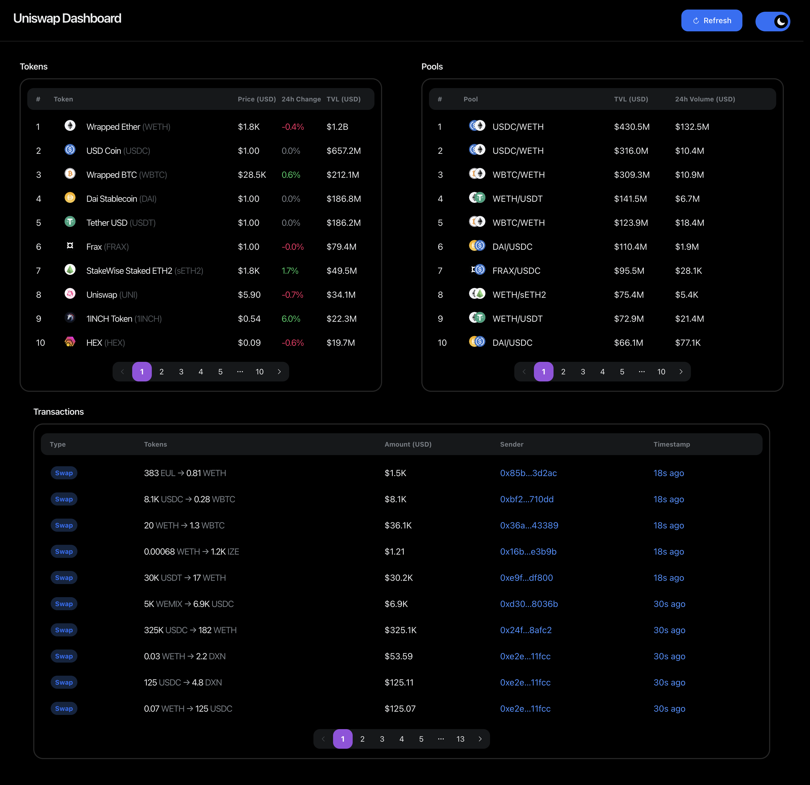

# Uniswap Dashboard

A React frontend visualizing data from the Uniswap V3 Subgraph.



## Getting Started

To install dependencies:

```bash
yarn
```

To run the development server:

```bash
yarn dev
```

Open [http://localhost:3000](http://localhost:3000) with your browser to see the result.

### Testing

```bash
yarn test
```

### Development

GraphQL queries are defined in the `gql/queries` folder and types are generated using [graphql-codegen](https://the-guild.dev/graphql/codegen).

To generate GraphQL types from queries:

```bash
yarn codegen
```

## Tech Stack

This is a [Next.js](https://nextjs.org/) project bootstrapped with [`create-next-app`](https://github.com/vercel/next.js/tree/canary/packages/create-next-app).

### Packages

- [Apollo](https://www.apollographql.com/) - GraphQL client
- [NextUI](https://nextui.org/) - UI component library
- [viem](https://viem.sh/) - Ethereum utility functions
- [Jest](https://jestjs.io/) - testing
